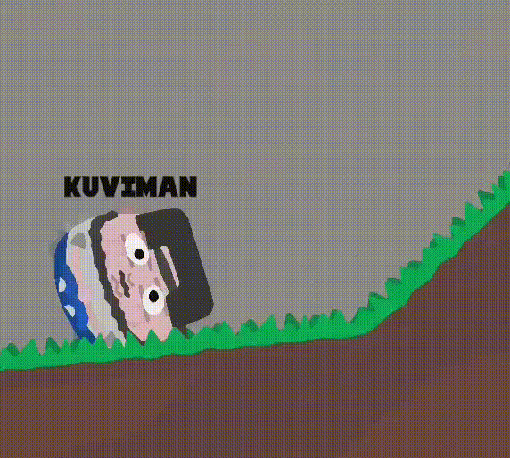

# Beans of Power

## Play

You can play the game on [itch.io](https://kuviman.itch.io/beans-of-power).

*The game was initially created for [Ludum Dare 51](https://ldjam.com/events/ludum-dare/51/getting-farted-on) game jam in 48 hours (the theme was "Every 10 Seconds"), you can check out the [jam version here](https://kuviman.github.io/beans-of-power/jam/), jam version source is available at [jam-version branch](https://github.com/kuviman/beans-of-power/tree/jam-version)*

## Description

*Rage game*.

You have had some magic beans. Now you have power. Too much power.

You are trying really hard to hold that power so you cant even walk like a human. All you can do is roll.

**Use A/D or Left/Right to roll in desired direction**.

You can only hold it for so long though.
At some point it is going to be too much power and some of it will have to be released, resulting in an auto jump.

**You can also press W/Up/Space to force a jump**. This, same as auto jump, releases some of the power.
